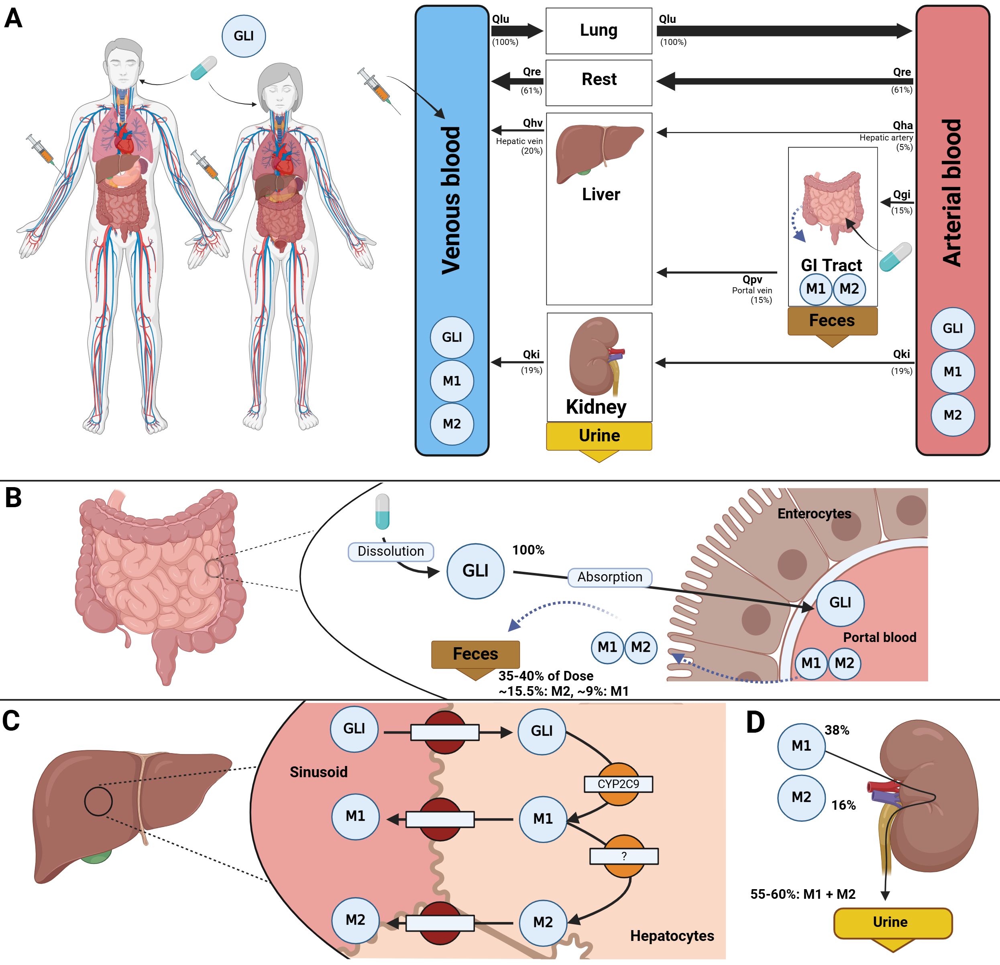

[](https://doi.org/10.5281/zenodo.14628700)
[](https://github.com/matthiaskoenig/glimepiride-model/actions/workflows/python.yml)
[](https://github.com/matthiaskoenig/glimepiride-model/actions/workflows/docker.yml)

# Glimepiride Model
This repository (https://github.com/matthiaskoenig/glimepiride-model) provides the glimepiride physiologically based pharmacokinetics (PBPK) model.

The model is distributed in [SBML](http://sbml.org) format available from [`glimepiride_body_flat.xml`](./models/glimepiride_body_flat.xml) with 
corresponding [SBML4humans model report](https://sbml4humans.de/model_url?url=https://raw.githubusercontent.com/matthiaskoenig/glimepiride-model/main/models/glimepiride_body_flat.xml) and [model equations](./models/glimepiride_body_flat.md).

The COMBINE archive is available from [`glimepiride_model.omex`](./glimepiride_model.omex).
The FAIR assessment is available from [`glimepiride_model_fair.xlsx`](./glimepiride_model_fair.xlsx).



### Comp submodels
* **liver** submodel [`glimepiride_liver.xml`](./models/glimepiride_liver.xml) with [SBML4humans report](https://sbml4humans.de/model_url?url=https://raw.githubusercontent.com/matthiaskoenig/glimepiride-model/main/models/glimepiride_liver.xml) and [equations](./models/glimepiride_liver.md).
* **kidney** submodel [`glimepiride_kidney.xml`](./models/glimepiride_kidney.xml) with [SBML4humans report](https://sbml4humans.de/model_url?url=https://raw.githubusercontent.com/matthiaskoenig/glimepiride-model/main/models/glimepiride_kidney.xml) and [equations](./models/glimepiride_kidney.md).
* **intestine** submodel [`glimepiride_intestine.xml`](./models/glimepiride_intestine.xml) with [SBML4humans report](https://sbml4humans.de/model_url?url=https://raw.githubusercontent.com/matthiaskoenig/glimepiride-model/main/models/glimepiride_intestine.xml) and [equations](./models/glimepiride_intestine.md).
* **whole-body** submodel [`glimepiride_body.xml`](./models/glimepiride_body.xml) with [SBML4humans report](https://sbml4humans.de/model_url?url=https://raw.githubusercontent.com/matthiaskoenig/glimepiride-model/main/models/glimepiride_body.xml) and [equations](./models/glimepiride_body.md).

## How to cite
To cite the model repository

> Elias, M., & König, M. (2025).
> *Physiologically based pharmacokinetic (PBPK) model of glimepiride.*   
> Zenodo. [https://doi.org/10.5281/zenodo.14628700](https://doi.org/10.5281/zenodo.14628700)

To cite the main publication

> Elias, M., & König, M. (2025).
> *A Digital Twin of Glimepiride for Personalized and Stratified Diabetes Treatment.*   
> Front. Pharmacol. 16:1686415. [doi:10.3389/fphar.2025.1686415](https://doi.org/10.3389/fphar.2025.1686415)

To cite the reproducibility publication

> Elias, M., & König, M. (2025).
> *Reproducibility of a Digital Twin of Glimepiride for Personalized and Stratified Diabetes Treatment*   
> Physiome. 2025 October (accepted) [doi:10.36903/physiome.28379193](https://doi.org/10.36903/physiome.28379193) 


## License

* Source Code: [MIT](https://opensource.org/license/MIT)
* Documentation: [CC BY-SA 4.0](https://creativecommons.org/licenses/by-sa/4.0/)
* Models: [CC BY-SA 4.0](https://creativecommons.org/licenses/by-sa/4.0/)

This program is distributed in the hope that it will be useful, but WITHOUT ANY
WARRANTY; without even the implied warranty of MERCHANTABILITY or FITNESS FOR A
PARTICULAR PURPOSE.

## Run simulations
### python
Clone the repository 
```bash
git clone https://github.com/matthiaskoenig/glimepiride-model.git
cd glimepiride-model
```

#### uv
Setup environment with uv (https://docs.astral.sh/uv/getting-started/installation/)
```bash
uv sync
```
Run the complete analysis:
```bash
uv run run_glimepiride -a all -r results
```

#### pip
If you use pip install the package via
```bash
pip install -e .
```
Run the complete analysis in the environment via:
```bash
run run_glimepiride -a all -r results
```

### docker
Simulations can also be run within a docker container:

```bash
docker run -v "${PWD}/results:/results" -it matthiaskoenig/glimepiride:latest /bin/bash
```

Run the complete analysis:
```bash
uv run run_glimepiride -a all -r /results
```
The results are written into the mounted `/results` folder on the host.

In case of permission issues with the mounted folder, adjust ownership and access rights with:
```bash
sudo chown $(id -u):$(id -g) -R "${PWD}/results"
sudo chmod 775 "${PWD}/results"
```

## Funding
Matthias König was supported by the Federal Ministry of Education and Research (BMBF, Germany) within LiSyM by grant number 031L0054 and ATLAS by grant number 031L0304B and by the German Research Foundation (DFG) within the Research Unit Program FOR 5151 QuaLiPerF (Quantifying Liver Perfusion-Function Relationship in Complex Resection - A Systems Medicine Approach) by grant number 436883643 and by grant number 465194077 (Priority Programme SPP 2311, Subproject SimLivA). This work was supported by the BMBF-funded de.NBI Cloud within the German Network for Bioinformatics Infrastructure (de.NBI) (031A537B, 031A533A, 031A538A, 031A533B, 031A535A, 031A537C, 031A534A, 031A532B). 

© 2024-2026 Michelle Elias & Matthias König, [Systems Medicine of the Liver](https://livermetabolism.com)
